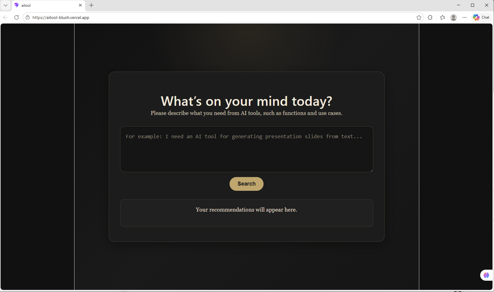

# AI Tool Recommendation Frontend

## LIve Demo
https://aitool-blush.vercel.app

## Screenshot


## Overview
AI tools recommendation web app built with React and a serverless AWS backend. 
Supports natural language queries, parses user intent into structured tags, and retrieves relevant tools from a curated database using scoring and fallback logic.

## Features
- Natural language query input
- Integration with AWS API Gateway + Lambda backend
- Displays ranked tool recommendations
- Clean, minimal UI built with React + Vite

## Tech Stack
- React (Vite)
- JavaScript (ES6+)
- CSS

## Run Locally
```bash
npm install
npm run dev
```

## Build
```bash
npm run build
```

## Deployment
Deployed on Vercel.

## Backend
This frontend connects to a serverless backend (AWS Lambda + API Gateway + MySQL).

